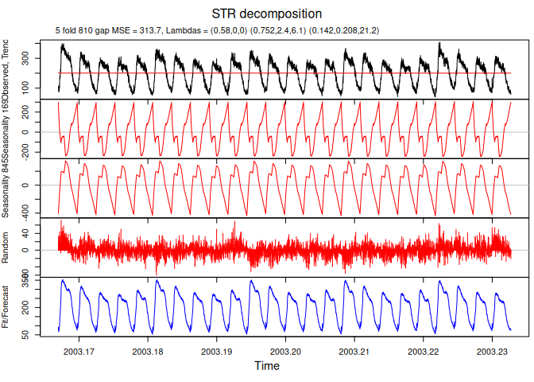
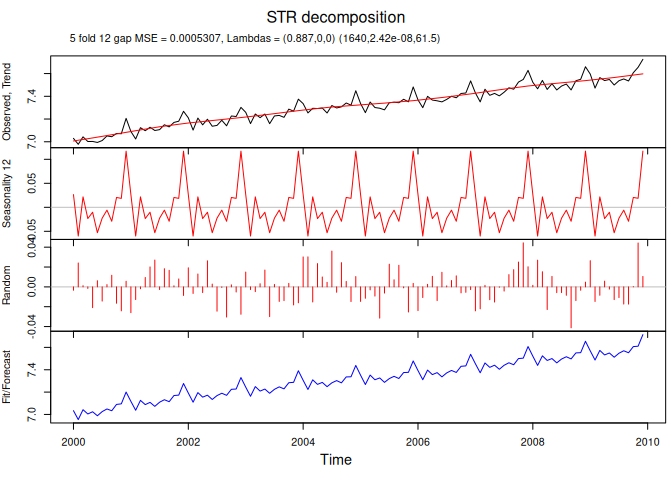

<!-- README.md is generated from README.Rmd. Please edit that file -->

# stR

<!-- badges: start -->

[](https://CRAN.R-project.org/package=stR)
[](https://github.com/robjhyndman/stR/actions/workflows/R-CMD-check.yaml)
[](https://CRAN.R-project.org/package=stR)
<!-- badges: end -->

The goal of stR is to provide two methods for decomposing seasonal data:
STR (a Seasonal-Trend decomposition procedure based on Regression) and
Robust STR. In some ways, STR is similar to Ridge Regression and Robust
STR can be related to LASSO. They allow for multiple seasonal
components, multiple linear covariates with constant, flexible and
seasonal influence. Seasonal patterns (for both seasonal components and
seasonal covariates) can be fractional and flexible over time; moreover
they can be either strictly periodic or have a more complex topology.
The methods provide confidence intervals for the estimated components.
The methods can also be used for forecasting.

## Installation

You can install the **release** version from CRAN.

``` r
install.packages('stR')
```

You can install the **development** version from
[GitHub](https://github.com/robjhyndman/stR).

``` r
# install.packages("remotes")
devtools::install_github("robjhyndman/stR")
```

## Example

For most users, the `AutoSTR()` function will be the preferred way of
using the package.

``` r
library(stR)
```

``` r
# Decomposition of a multiple seasonal time series
decomp <- AutoSTR(calls)
plot(decomp)
```



``` r

# Decomposition of a monthly time series
decomp <- AutoSTR(log(grocery))
plot(decomp)
```



See the vignette for more advanced options.
